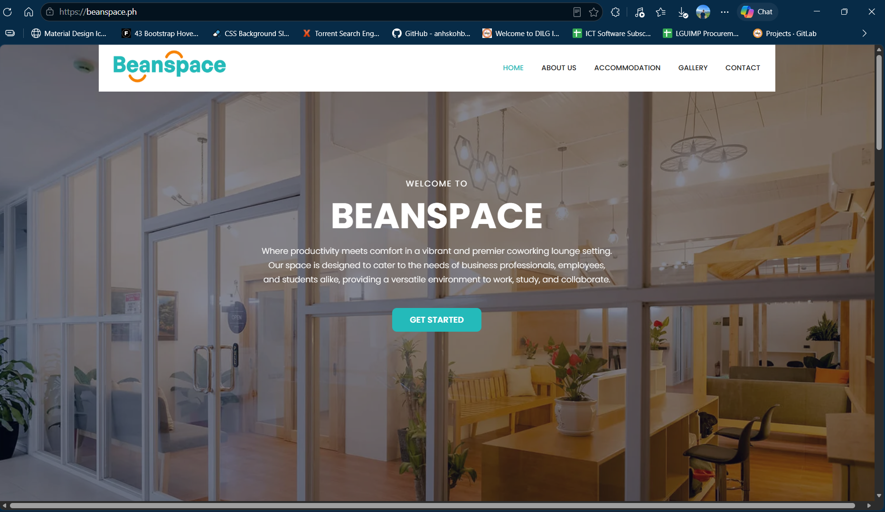
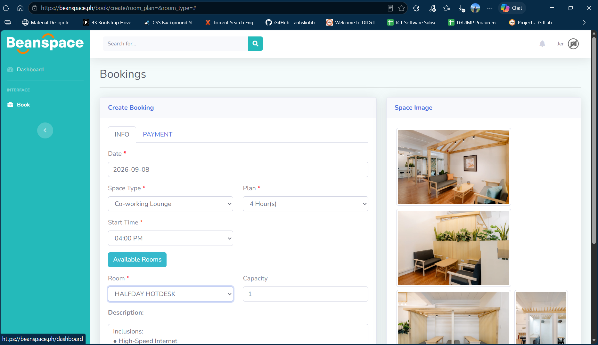
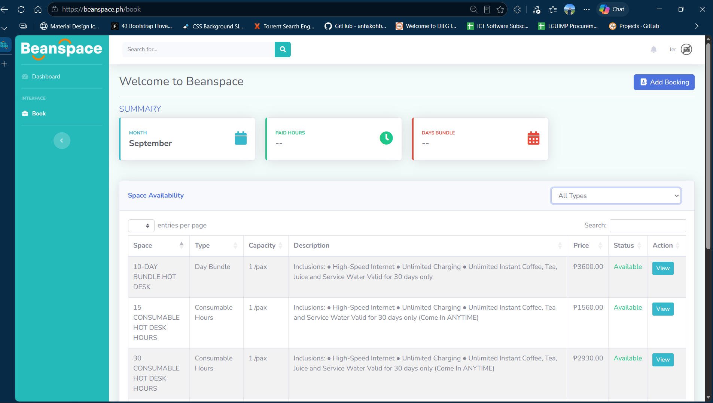

# 🏢 Beanspace – Room Reservation System

> A web-based room and space reservation platform developed
> for managing available spaces, reservations, approvals,
> and booking administration.

## 🌐 Live Website

https://www.beanspace.ph/

## 📌 Project Overview

I developed a room reservation system that allows clients
to browse available spaces and manage their reservations.

The system also provides administrators with tools to monitor,
approve, modify, and manage reservations.

## ✨ Key Features

- Room/space availability
- Reservation management
- Booking workflow
- Reservation approval
- Client booking management
- Administrative management
- Responsive web interface

## 👨‍💻 My Role

Software Developer

I was involved in:

- Requirements gathering
- Business analysis
- System development
- Database development
- Testing
- Deployment
- Troubleshooting
- Technical support

## 🛠️ Technologies

- PHP
- Laravel / PHP MVC
- JavaScript
- jQuery
- HTML5
- CSS3
- Bootstrap
- MySQL
- Git

## 📸 Screenshots

### Homepage

### Reservation

### Booking Management

## 🎥 Demo

A demonstration video of the system is available here:

[Watch the system demonstration](YOUR_VIDEO_LINK)

## ⚠️ Source Code

The original source code is not publicly available because
this project was developed as part of professional/client work.

This repository is a portfolio case study demonstrating
the system, functionality, and my role in its development.
